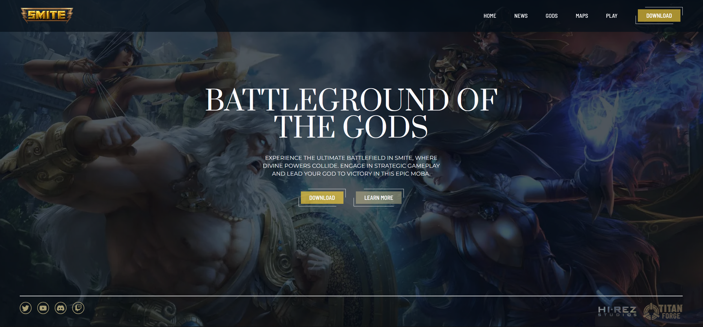

# Smite Landing Page

This is a landing page website for the game **Smite**, built with **Astro**, **TypeScript**, and **Tailwind CSS**. The website provides information about the game, including details about the gods, maps, and platforms where the game can be downloaded. It also features the latest news and updates about the game.



## Features

-   **Gods Section**: Displays information about different gods in the game, including their roles, abilities, and lore.
-   **Maps Section**: Provides information about the various maps in the game.
-   **Latest News**: Displays the latest news for Smite.
-   **Responsive Design**: The landing page is fully responsive, providing an optimal experience across different devices.
-   **Performance Optimized**: Fast and lightweight design for minimal load times.

## Tech Stack

-   **Astro**: Framework used for building static websites.
-   **TypeScript**: Static type-checking for scalable and maintainable code.
-   **Tailwind CSS**: Utility-first CSS framework used for styling.
-   **HTML5 & CSS3**: Used for page structure and styling.

## Getting Started

### Prerequisites

Make sure you have the following installed on your machine:

-   Node.js (>= 14.x)
-   npm (>= 6.x) or yarn

### Installation

1. Clone the repository:

    ```bash
    git clone https://github.com/yourusername/smite-landing-page.git
    ```

2. Navigate to the project directory:

    ```bash
    cd smite-landing-page
    ```

3. Install dependencies:
    ```bash
    npm install
    ```

### Running the Project Locally

1. Start the development server:

    ```bash
    npm run dev
    ```

2. Open your browser and go to `http://localhost:4321`.

## Contact

Feel free to reach out if you have any questions or would like to collaborate:

-   **Email**: arzoladeveloper@gmail.com
-   **LinkedIn**: [Your LinkedIn](https://www.linkedin.com/in/luis-arzola/)
-   **GitHub**: [Your GitHub](https://github.com/ArzolaG)
